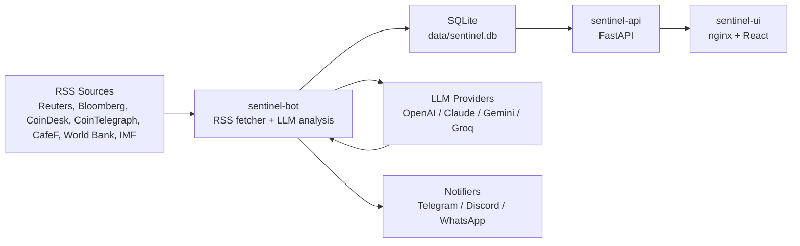

# Macro-Sentinel

Macro-Sentinel is a production-oriented Python bot for real-time macroeconomic and crypto news monitoring. It fetches RSS feeds, deduplicates URLs in SQLite, sends only new articles to a configurable LLM provider, and publishes concise market-impact alerts to chat platforms.

## What's New in v0.2.0

- Added a full Sentinel-AI V2 multi-container stack with Docker Compose.
- Split runtime into three isolated services: `sentinel-bot`, `sentinel-api`, and `sentinel-ui`.
- Added a FastAPI backend for health checks, runtime config, processed article stats, and recent article history.
- Added a React dashboard served by nginx at `http://localhost:8080`.
- Added nginx reverse proxy routing from `/api/*` to the internal FastAPI service.
- Standardized shared persistent state through `config.yaml` and `data/sentinel.db`.
- Added SQLite WAL mode and busy timeout for safer concurrent bot/API access.
- Added `tenacity` retry handling for LLM rate-limit errors such as HTTP 429.

## Key Features

| Capability | What it provides | Supported options |
| --- | --- | --- |
| Multi-LLM factory | One interface for multiple model providers | OpenAI, Anthropic, Gemini, Groq |
| Multi-channel delivery | Modular notification adapters | Telegram, Discord, WhatsApp webhook |
| Token optimization | SQLite URL dedupe, article length caps, concise prompts | Configurable per run |
| API layer | FastAPI endpoints for health, config, stats, and article history | Internal Compose network |
| Web dashboard | React static UI served by nginx | `http://localhost:8080` |
| Production logging | Structured console and rotating file logs | Loguru, `logs/macro.log` |
| Container deployment | Isolated multi-service runtime with persistent state | Docker, Docker Compose |

## Architecture Diagram



## Project Structure

```text
.
|-- frontend/
|   |-- src/
|   |-- index.html
|   |-- nginx.conf
|   |-- package.json
|   `-- vite.config.js
|-- src/macro_sentinel/
|   |-- api.py
|   |-- app.py
|   |-- analysis.py
|   |-- llm_clients.py
|   |-- models.py
|   |-- core/
|   |-- fetchers/
|   `-- notifiers/
|-- tests/
|-- config.yaml
|-- pyproject.toml
|-- Dockerfile
|-- docker-compose.yml
`-- README.md
```

## Configuration

Edit `config.yaml`:

```yaml
Language: vi
Active_LLM: openai
Active_Channels:
  - telegram
```

Supported values:

- `Language`: `vi`, `en`, `fr`, `it`, `es`, `de`, `zh`
- `Active_LLM`: `openai`, `anthropic`, `gemini`, `groq`
- `Active_Channels`: `telegram`, `discord`, `whatsapp`

Create `.env` from `.env.example` and fill the credentials required by your selected provider and channels.

## Install with Poetry

```powershell
poetry install --with dev
copy .env.example .env
```

Set required environment variables in `.env`, then run once:

```powershell
poetry run macro-sentinel --config config.yaml
```

Run continuously:

```powershell
poetry run macro-sentinel --config config.yaml --loop --interval 300
```

Developer checks:

```powershell
poetry run ruff check .
poetry run pytest
```

## Run with Docker Compose

Create `.env`:

```powershell
copy .env.example .env
```

Start the stack:

```powershell
docker compose up -d --build
```

Open the dashboard:

```text
http://localhost:8080
```

The stack starts three isolated services on the `sentinel-net` bridge network:

- `sentinel-bot`: runs the RSS/LLM worker loop.
- `sentinel-api`: serves FastAPI on port `8000` inside the Compose network.
- `sentinel-ui`: serves the React static UI with nginx on `http://localhost:8080`.

Follow logs:

```powershell
docker compose logs -f sentinel-bot sentinel-api sentinel-ui
```

Stop the stack:

```powershell
docker compose down
```

Docker Compose mounts persistent folders:

- `./config.yaml:/app/config.yaml:ro` for shared runtime configuration.
- `./data:/app/data` for `data/sentinel.db` SQLite deduplication state.
- `./logs:/app/logs` for rotating Loguru files.

## Internal Networking

All services join the private Docker bridge network `sentinel-net`. The UI container is the only service exposed to the host through port `8080`. Browser requests to `/api/*` go to nginx in `sentinel-ui`, then nginx forwards them internally to `http://sentinel-api:8000`.

The bot and API do not need public ports. They communicate through shared files and the Docker network:

- `sentinel-bot` writes processed article state to `/app/data/sentinel.db`.
- `sentinel-api` reads the same SQLite database and exposes safe JSON endpoints.
- `sentinel-ui` reads API data through nginx proxy routes.

## Logging

Loguru is configured in `src/macro_sentinel/core/logging.py`:

- colored console output
- file output at `logs/macro.log`
- `rotation="10 MB"`
- `retention="10 days"`

## CI

GitHub Actions runs on every push and pull request:

1. Set up Python 3.11
2. Install dependencies with Poetry
3. Run `ruff check .`
4. Run `pytest`

Workflow file: `.github/workflows/ci.yml`

## License

MIT
